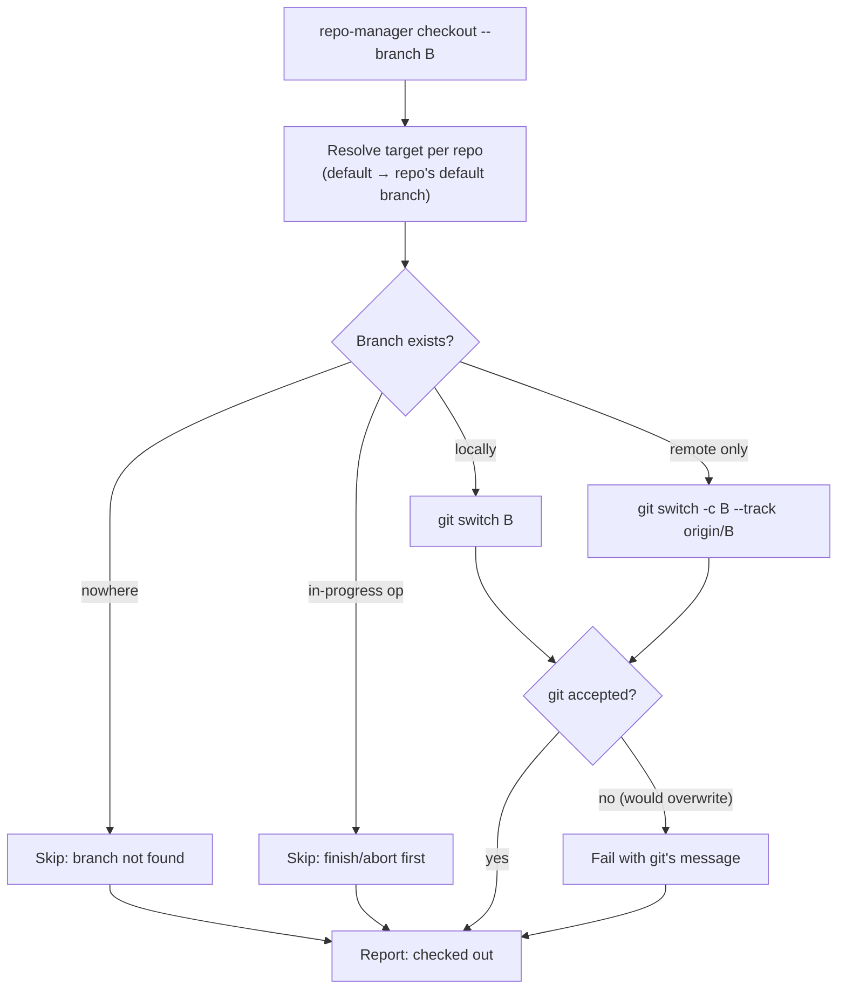

# checkout

Check out a branch across selected repositories, creating local tracking branches from
the remote when needed.

## What it does

For each selected repository, `checkout` resolves the target branch, then switches to
it. If the branch exists locally, it switches. If it exists only on the remote, it
creates a local tracking branch. `--branch default` resolves to each repository's own
configured default, so one command can return a mixed workspace to its per-repo
defaults.

`checkout` is permissive by design: it only pre-skips a repository that is mid-operation
(rebase, merge, and so on) or a branch that exists nowhere. If a dirty worktree would be
overwritten by the switch, git itself refuses, and that refusal is reported as a
failure with git's own message, so nothing is lost.



## How the options change it

- **`--branch`** (required) is the branch to check out, or the literal `default` to use
  each repository's configured default branch.
- **`--dry-run`** previews the plan and makes no change.
- **`--yes` / `-y`** skips confirmation; required to mutate non-interactively.
- **`--ignore-skips`** downgrades a skip-only run to exit `0`.
- **`--group` / `--repo` / `--select`** narrow the target set.
- **`--jobs`** sets fetch parallelism.

## Options

--8<-- "reference/_generated/checkout.md"

## Examples

```bash
# One branch across a group, creating tracking branches as needed.
repo-manager checkout --branch dev --group backend --yes

# Return selected repos to their own default branches.
repo-manager checkout --branch default --repo api --yes

# Preview first.
repo-manager checkout --branch release/1.2 --group services --dry-run
```
