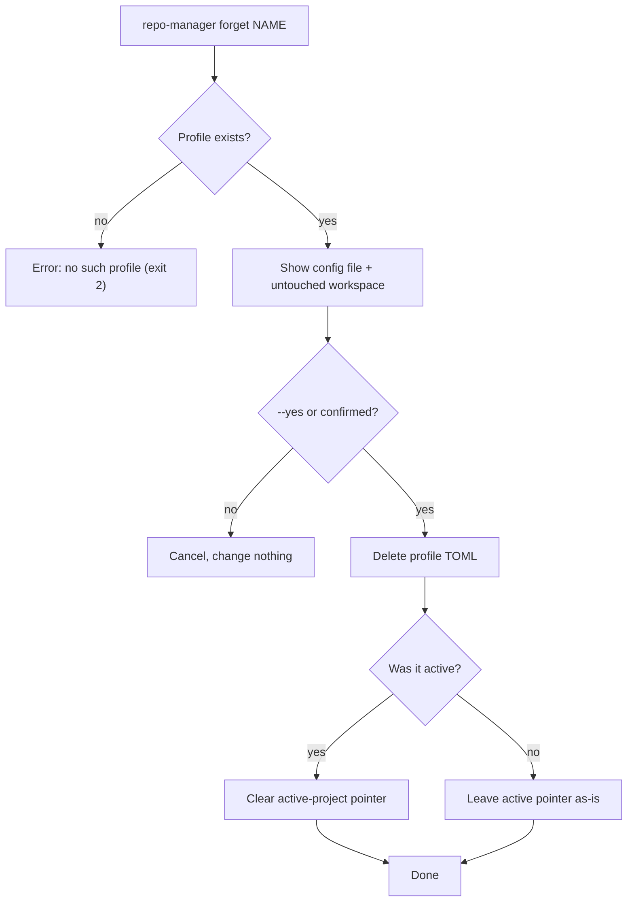

# forget

Remove a saved profile. `forget` deletes only the profile's config file. It never
touches a repository or the workspace on disk.

## What it does

`forget` prints the exact config file it will remove and the workspace path it leaves
untouched, asks for confirmation, then deletes the profile TOML. If the removed profile
was the active one, the active-project pointer is cleared. No repository, working tree,
or Git history is affected.

There is no command that deletes repositories or workspace directories; that is out of
scope by design, the same reason a destructive discard is not offered.



## How the options change it

- **`--yes` / `-y`** skips the confirmation prompt. Required to run non-interactively;
  without a TTY and without `--yes`, `forget` refuses rather than deleting silently.

## Options

--8<-- "reference/_generated/forget.md"

## Examples

```bash
repo-manager forget old-workspace        # confirms, then removes the profile
repo-manager forget old-workspace --yes  # non-interactive
```
