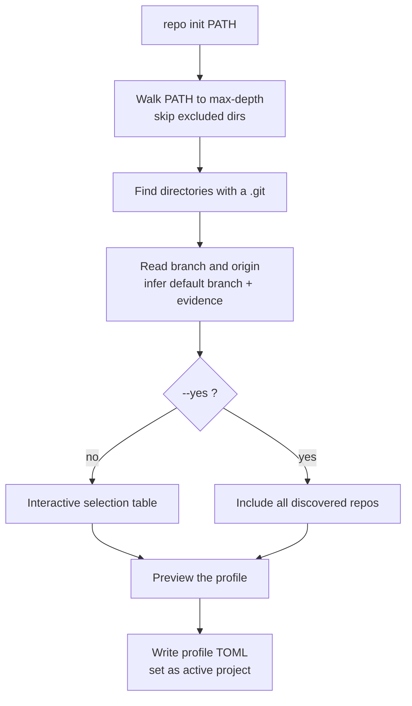

# init

Scan a workspace directory, discover the Git repositories inside it, and save a
profile. `init` performs no Git mutation and no network fetch.

## What it does

`init` walks the workspace root down to `--max-depth`, skipping excluded directories
(`.git`, `.venv`, `node_modules`, and so on), and treats every directory containing a
`.git` as a repository. For each one it reads the current branch and origin URL, and
infers a default branch, recording the evidence (remote `HEAD`, the current upstream,
or a common name like `main`) so you can tell a proven default from a guess.

It then shows a selectable table. You choose which repositories to include, review a
preview of the project, and it is written to
`~/.config/repo/projects/<name>.toml`. Nothing is fetched, and no repository
is modified.



## How the options change it

- **`--name`** sets the profile name, which is also its file name. Defaults to the
  workspace directory name.
- **`--max-depth`** bounds how deep discovery walks. A repository nested deeper than
  this is not found. The default of `4` suits most service trees.
- **`--remote`** sets the default remote recorded in the profile (default `origin`).
- **`--include-linked-worktrees`** includes linked worktrees (a `.git` *file* rather
  than a directory), which are skipped by default.
- **`--include-nested`** keeps discovery walking *past* a repository, so independent
  clones nested inside an umbrella repo are found. See below.
- **`--yes` / `-y`** skips the interactive table and includes every repository found.
  Use it in scripts.

## Umbrella repositories (`--include-nested`)

By default, discovery stops at the first `.git` it finds and does not look inside a
repository, so a repository's own subdirectories and submodules are never listed as
separate entries.

That rule hides a common layout: an **umbrella repository** whose working tree
contains independent clones (a services checkout that itself holds `platform`,
`domain-agents/*`, and so on). Because the umbrella root is itself a repo, plain
`init` records only the root and prunes everything beneath it.

`--include-nested` descends past a found repository to surface the independent clones
inside it. It stays conservative:

- Only **independent clones** (their own `.git` *directory*) are surfaced.
- **Submodules** and **linked worktrees** (a `.git` *file*) are skipped, so
  dependency and package repos do not flood the list.
- Excluded directories (`node_modules`, `.venv`, `vendor`, build output, and the
  rest) are still skipped.

The setting is saved to the profile as `discovery.descend_into_repositories`.
- **`--activate`** controls whether the new profile becomes the active one. On by
  default, so later commands need no `--project`.

## Options

--8<-- "reference/_generated/init.md"

## Examples

```bash
# Interactive: scan, pick repositories, review, then save.
repo init ~/work/services --name services

# Non-interactive: take everything discovered.
repo init ~/work/services --name services --yes

# Shallow scan against a non-origin remote.
repo init ~/work/services --max-depth 2 --remote upstream --yes

# Umbrella repo: the root is itself a git repo holding independent clones.
repo init ~/work/services-env --name services --include-nested

# Example: a Git umbrella root containing independent child clones.
repo init /Users/mchoudhary/docker-env --name core --include-nested --yes
```

If the workspace root is already a Git repository, the default scan records that root
and stops there. For example, a root such as `/Users/mchoudhary/docker-env` may contain
`Entrata/.git`, `Common/.git`, and `LeaseManagement/.git`, but a normal scan still saves
only `path = "."`. Use `--include-nested` to discover those independent child clones.

After rescanning, verify the saved entries with:

```bash
repo core status
```

The detailed table shows both the saved repository name and its relative path. A
submodule or linked worktree has a `.git` file and remains excluded unless linked
worktrees are explicitly enabled.

See [Configuration](../concepts/configuration.md) for the profile schema and the full
default-branch inference order.
