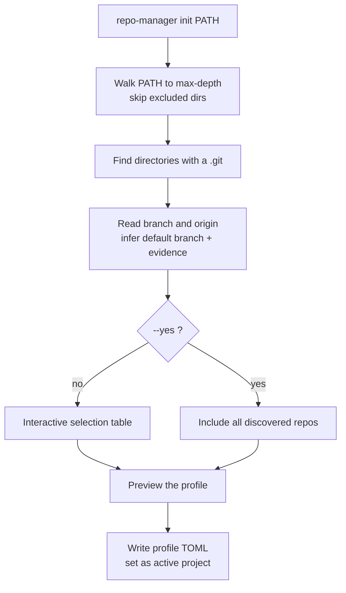

# init

Scan a workspace directory, discover the Git repositories inside it, and save a
profile. `init` performs no Git mutation and no network fetch.

## What it does

`init` walks the workspace root down to `--max-depth`, skipping excluded directories
(`.git`, `.venv`, `node_modules`, and so on), and treats every directory containing a
`.git` as a repository. For each one it reads the current branch and origin URL, and
infers a default branch, recording the evidence (remote `HEAD`, the current upstream,
or a common name like `main`) so you can tell a proven default from a guess.

It then shows a selectable table. You choose which repositories to include, review a
preview of the profile, and it is written to
`~/.config/repo-manager/projects/<name>.toml`. Nothing is fetched, and no repository
is modified.



## How the options change it

- **`--name`** sets the profile name, which is also its file name. Defaults to the
  workspace directory name.
- **`--max-depth`** bounds how deep discovery walks. A repository nested deeper than
  this is not found. The default of `4` suits most service trees.
- **`--remote`** sets the default remote recorded in the profile (default `origin`).
- **`--include-linked-worktrees`** includes linked worktrees (a `.git` *file* rather
  than a directory), which are skipped by default.
- **`--yes` / `-y`** skips the interactive table and includes every repository found.
  Use it in scripts.
- **`--activate`** controls whether the new profile becomes the active one. On by
  default, so later commands need no `--project`.

## Options

--8<-- "reference/_generated/init.md"

## Examples

```bash
# Interactive: scan, pick repositories, review, then save.
repo-manager init ~/work/services --name services

# Non-interactive: take everything discovered.
repo-manager init ~/work/services --name services --yes

# Shallow scan against a non-origin remote.
repo-manager init ~/work/services --max-depth 2 --remote upstream --yes
```

See [Configuration](../concepts/configuration.md) for the profile schema and the full
default-branch inference order.
