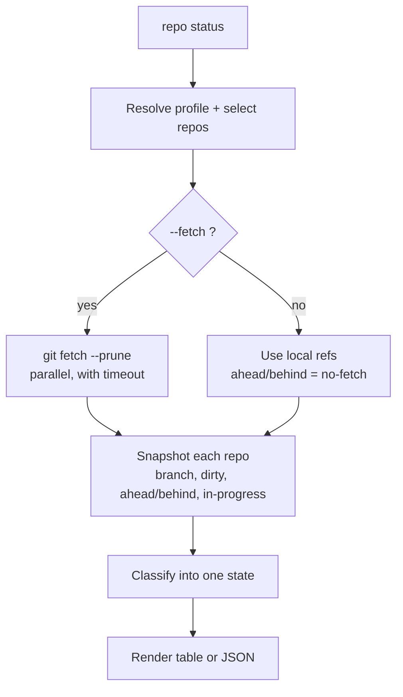

# status

`repo status` is a local-only overview of every saved project. It shows the project
root and counts for child repositories: total, clean, dirty, in progress, and missing
worktrees. Use `repo <project> status` for repository details.

## Project detail

`status` builds a snapshot of each selected repository: current branch (or detached
HEAD), upstream, staged / unstaged / untracked counts, ahead and behind counts, and
any in-progress operation. It reduces each to one [state](../concepts/safety-model.md)
and renders a table.

Without `--fetch` it does not contact any remote, and the ahead/behind column reads
`no-fetch` rather than showing possibly-stale numbers. With `--fetch`, remotes are
fetched in parallel first (each with a timeout), so an unreachable or credential-gated
remote becomes `remote-unavailable` instead of hanging the run. Stale remote-tracking
refs are never presented as if they were current.



## How the options change it

- **`--fetch`** updates remote-tracking refs first so ahead/behind counts are real.
  This is the only thing that makes `status` touch the network.
- **`--group` / `--repo` / `--select`** narrow which repositories are reported. See
  [selecting repositories](index.md#selecting-repositories).
- **`--json`** emits the full, versioned `StatusReport` structure instead of a table.
  This is the contract for scripts.
- **`--jobs`** sets how many repositories are read and fetched in parallel.

## Reading the table

| Column | Meaning |
| --- | --- |
| Branch | Current branch, or `detached@<sha>` |
| State | One of the [repository states](../concepts/safety-model.md) |
| ↑ / ↓ | Commits ahead / behind upstream, or `no-fetch` / `unreachable` |
| Changes | `Ns` staged, `Nm` modified, `N?` untracked, `Nu` unmerged |
| Last commit | Short SHA and subject |

## Options for project detail

--8<-- "reference/_generated/project-status.md"

## Examples

```bash
repo <project> status                    # local-only, fast
repo <project> status --fetch            # real ahead/behind
repo <project> status --group backend    # one group
repo <project> status --select dirty     # only repos with local work
repo <project> status --json             # machine-readable
```
