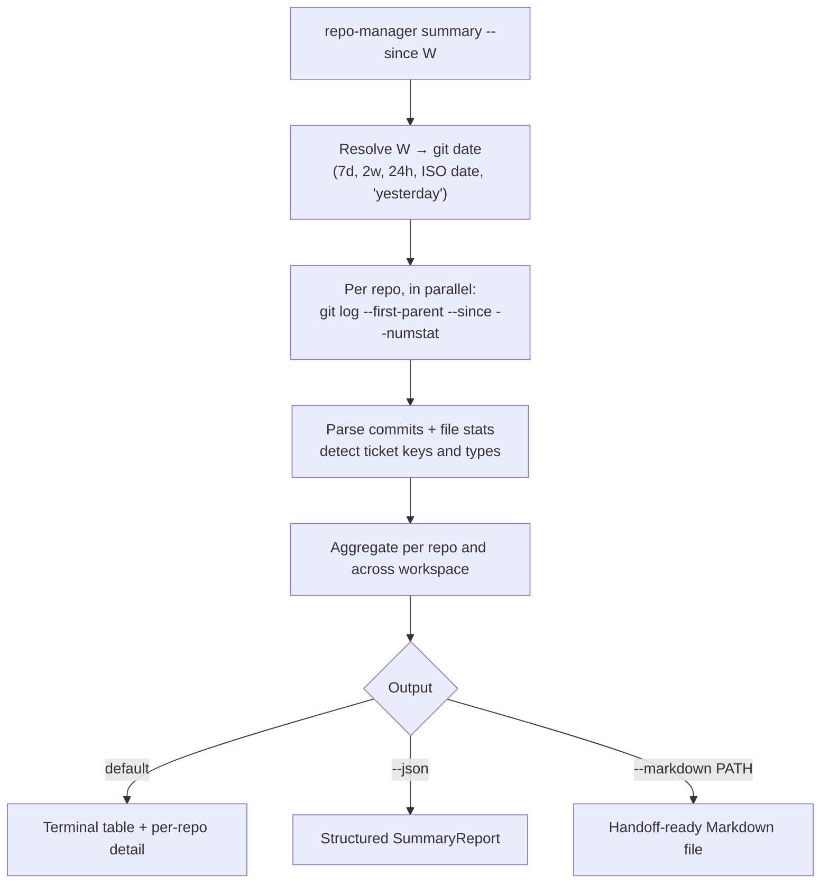

# summary

Summarize commits across selected repositories since a date. Read-only.

## What it does

For each selected repository, `summary` collects the commits on the currently
checked-out branch since a cutoff, with per-commit file statistics, then aggregates
across the workspace. It produces one structured report rendered as a terminal table,
JSON, or Markdown. There is no stored review cursor: the range is always derived from
`--since`, so nothing goes stale after a rebase.

**Date rule:** commits are selected by committer date (git's `--since` default),
first-parent, on each repository's HEAD.



## What it collects

Per repository and aggregated:

- Commit SHA, author, committer date, and subject.
- Insertions, deletions, and files changed per commit and in total.
- Top-level directories touched, ordered by how many files changed in each.
- Detected references: JIRA-style ticket keys (`ABC-123`) and conventional-commit
  types (`feat`, `fix`, ...) parsed from subjects.

## How the options change it

- **`--since`** sets the window. Accepts duration shorthand (`7d`, `2w`, `24h`), an
  ISO date (`2026-07-01`), or any expression git understands (`yesterday`,
  `2 weeks ago`). Defaults to `7d`.
- **`--markdown <path>`** writes a Markdown report to the path. Combine with the
  default table, or with `--json`.
- **`--json`** emits the full structured report to stdout.
- **`--group` / `--repo` / `--select`** narrow the target set. For summaries,
  `--select` also understands `changed` and `quiet`.
- **`--jobs`** sets how many repositories are logged in parallel.

## Options

--8<-- "reference/_generated/summary.md"

## Examples

```bash
repo-manager summary --since 7d
repo-manager summary --since 2026-07-01 --group backend
repo-manager summary --since 7d --markdown standup.md
repo-manager summary --since 2w --select changed --json
```
