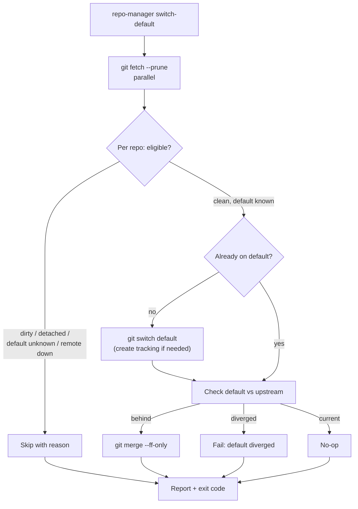

# switch-default

Switch each eligible repository to its configured default branch and fast-forward it.
Useful for returning a whole workspace to a clean baseline after feature work.

## What it does

After fetching in parallel, `switch-default` moves each eligible repository onto its
default branch (creating a local tracking branch from the remote if needed), then
fast-forwards that branch. A dirty worktree, a detached HEAD, an unknown default
branch, or an unreachable remote causes a skip. If the default branch itself has
diverged from its upstream, the repository is reported as failed rather than silently
merged.



## How the options change it

- **`--dry-run`** previews the plan and makes no change.
- **`--stash-and-update`** stashes a dirty repository's work, switches to the default
  branch and fast-forwards, then restores the work onto that branch (conflict-safe, as
  with [`update`](update.md)).
- **`--yes` / `-y`** skips confirmation; required to mutate non-interactively.
- **`--ignore-skips`** downgrades a skip-only run to exit `0`.
- **`--group` / `--repo` / `--select`** narrow the target set.
- **`--jobs`** sets fetch parallelism.

!!! note "Deprecated alias"
    `sync` is a hidden, deprecated alias for `switch-default`. Prefer the explicit
    name; `sync` prints a deprecation notice.

## Options

--8<-- "reference/_generated/switch-default.md"

## Examples

```bash
repo-manager switch-default --dry-run
repo-manager switch-default --select clean --yes
repo-manager switch-default --stash-and-update --repo api --yes
```
