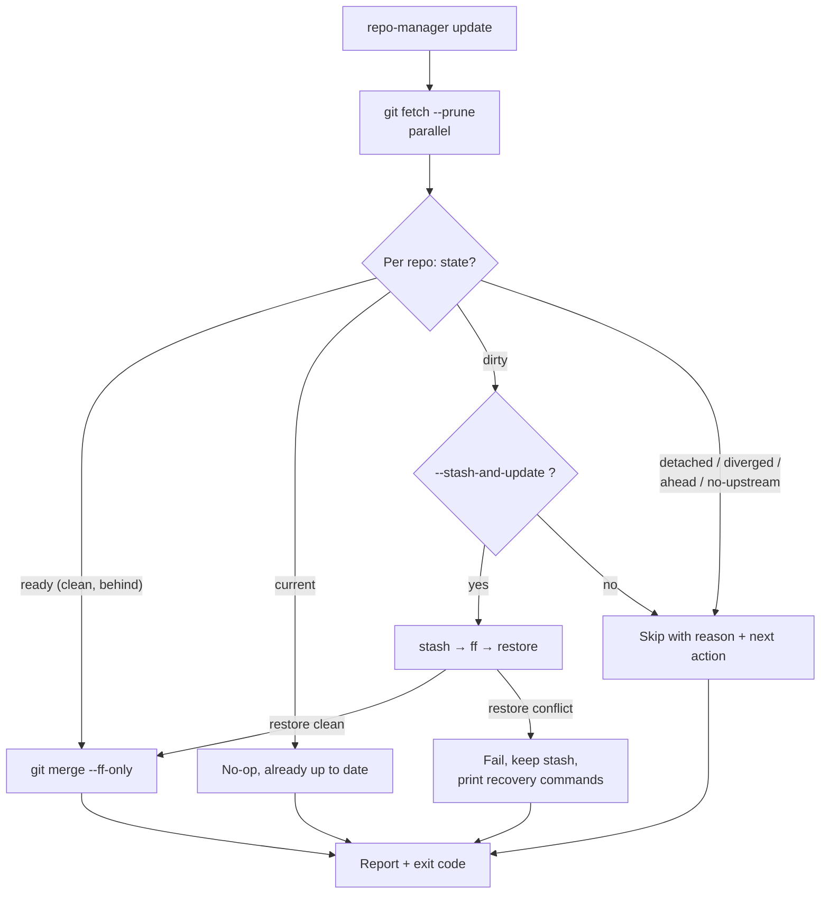

# update

Fast-forward the current branch of every eligible repository. `update` never switches
branches.

## What it does

`update` fetches all selected repositories in parallel, then decides per repository
whether a fast-forward is safe. Only a `ready` repository (clean, tracking, and behind
its upstream) is updated; everything else is skipped with a reason and a next action.
Mutations run serially and locally against the ref the fetch already updated, so the
command never blocks on the network mid-operation.



## Safety, briefly

A clean fast-forwardable branch is the only default mutation case. See the
[policy table](../concepts/safety-model.md#policy-by-operation) for what happens in
every state, and [Recovering local work](../guides/recovery.md) for the
`--stash-and-update` lifecycle.

## How the options change it

- **`--dry-run`** runs the fetch and the decision, prints the plan, and executes no
  mutation. The safest way to preview.
- **`--stash-and-update`** lets a *dirty* repository update anyway: it stashes local
  work (including untracked files), fast-forwards, then restores. A conflicting
  restore keeps the stash and prints recovery commands. It never touches an
  in-progress repository.
- **`--yes` / `-y`** skips the confirmation prompt. Required to mutate
  non-interactively; without a TTY and without `--yes`, `update` refuses rather than
  changing anything silently.
- **`--ignore-skips`** downgrades a skip-only run to exit `0`, for shell prompts and
  non-blocking scripts.
- **`--group` / `--repo` / `--select`** narrow the target set.
- **`--jobs`** sets fetch parallelism.

## Options

--8<-- "reference/_generated/update.md"

## Exit codes

--8<-- "reference/_generated/exit-codes.md"

## Examples

```bash
repo-manager update --dry-run                 # preview, change nothing
repo-manager update --yes                      # fast-forward the eligible repos
repo-manager update --group backend --yes
repo-manager update --stash-and-update --repo api --yes
```
